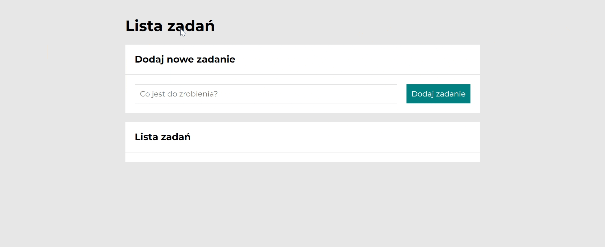

# to-do list
## Demo
https://ewa14.github.io/to-do-list/
## Description
This website lets you create a simple to-do list. You can add new tasks, mark them as done, or delete them.

To add a new task, enter the data into the active form input and click enter or "Dodaj zadanie" button.

To mark the task as completed, use the green button on its left. 
To delete a task, use the red button on its right.
## Technologies used
- HTML
- CSS (grid, media queries)
- normalize.css
- BEM naming convention
- Javascript (arrays, objects, **forEach** and **for...of** loops)
- ES6 features (e.g. arrow functions, "const" keywords)
## Website preview
